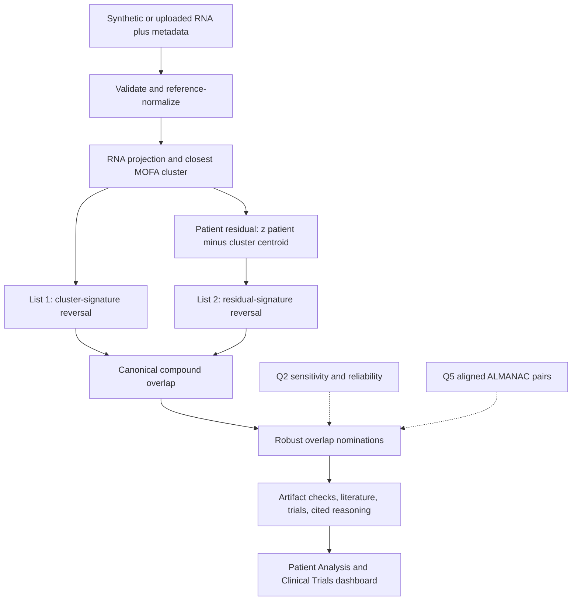

# MOFA Copilot V2

A local-first research prototype that places a patient into an RNA-surrogate
MOFA cluster, builds **List 1** (cluster-signature reversal) and **List 2**
(patient residual `z_patient − cluster_centroid` reversal), nominates their
**canonical overlap**, annotates with Q2 and cell-line-aligned ALMANAC pairs,
and presents results in a staged split-screen clinician UI.

**This is not a diagnostic or treatment-decision tool.** See
[`LIMITATIONS.md`](./LIMITATIONS.md).

## Documentation map

- [`RUNBOOK.md`](./RUNBOOK.md) — install, secrets, artifacts, local/Docker.
- [`CLINICIAN_GUIDE.md`](./CLINICIAN_GUIDE.md) — how to read Patient Analysis and Clinical Trials.
- [`TECHNICIAN_GUIDE.md`](./TECHNICIAN_GUIDE.md) — architecture and extension points.
- [`DATA_PROVENANCE.md`](./DATA_PROVENANCE.md) — artifact and evidence provenance.
- [`LIMITATIONS.md`](./LIMITATIONS.md) — scientific and privacy boundaries.

## Target workflow

## Privacy boundaries

- Patient expression stays on the local machine / API host.
- Paperclip receives only gene or drug/target query terms.
- ClinicalTrials.gov receives only minimum de-identified eligibility fields.
- Exports carry the same research-prototype banner as the UI.
